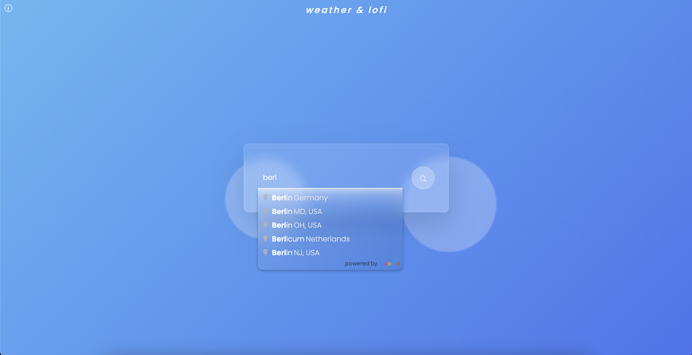
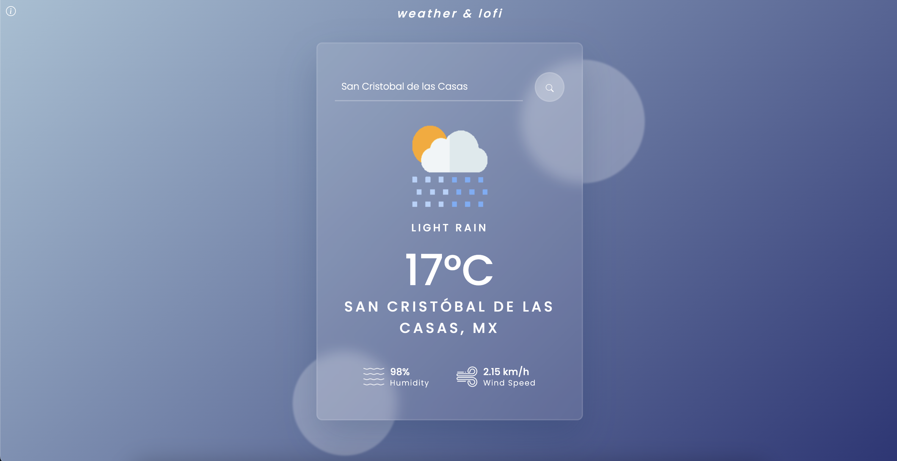
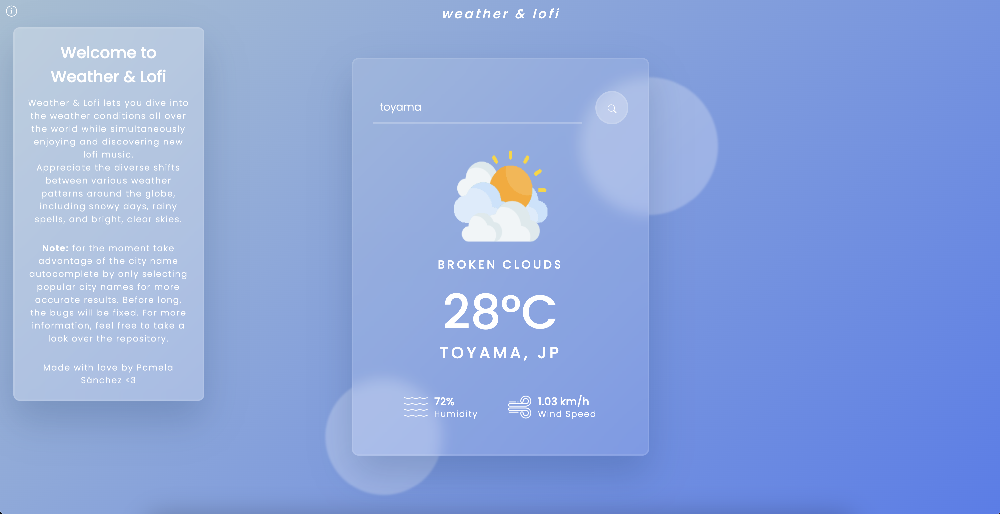

# Weather & Lofi
Weather & Lofi lets you search weather conditions all over the world while simultaneously listening and discovering new lofi music. The objective of this project was to develop a web application fully on JavaScript and get a notion of APIs implementing them.

The application has implemented:
- a build in city name autocomple using Google Places API
- OpenWeather API to retrieve the weather data
- and soon Spotify API to integrade background lofi music for a better UX

### Notes
Selecting cities with large populations (or popular city names) yields more accurate results from the city name autocomplete feature. Before long the bugs will be fixed. Feel free to examine the repository.

## Credits and aknowledgments
This application could not have been completed without the following YouTube channels:
- [GreatStack](https://www.youtube.com/@GreatStackDev)
- [Coding Artist](https://www.youtube.com/@CodingArtist)
